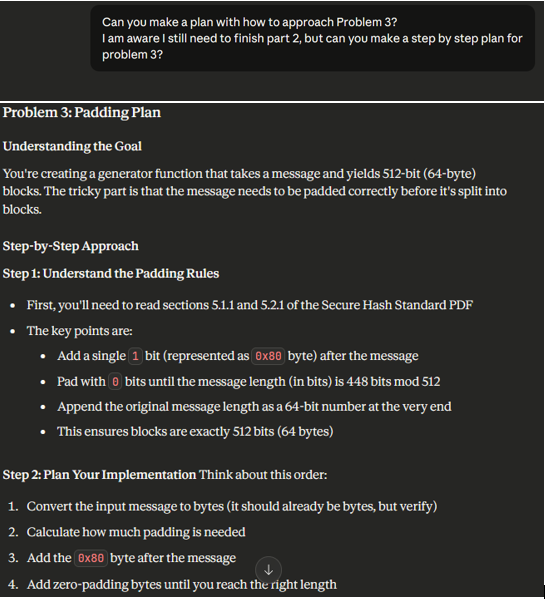

# COMPUTATIONAL THEORY ASSESSMENT

## Overview
In this repository you will find a comprehensive implementation of the Secure Hash Standard (SHA-256) algorithm and related cryptographic concepts. The assessment shows the use of binary operations, hash computation, message padding and password security using both practical and theoretical implementation.

The work done follows the NIST Federal Information Processing Standard (FIPS) 180-4 specification for the Secure Hash Standard.

## Link to NIST Federal Information Processing Standard (FIPS) 180-4 specification:
https://nvlpubs.nist.gov/nistpubs/FIPS/NIST.FIPS.180-4.pdf

## Main GitHub assignment page:
https://github.com/ianmcloughlin/computational-theory/tree/main

### Objectives

- 5 problems:
    1. Binary Words and Operations
        Implement the core bitwise operations according to the Secure Hash Standard specification:
        * `parity(x, y, z)` - Parity operation
        * `ch(x, y, z)` - Choose operation
        * `maj(x, y, z)` - Majority operation
        * `Sigma0(x)` & `Sigma1(x)` - Uppercase sigma functions (rotation based)
        * `sigma0(x)` & `sigma1(x)` - Lowercase sigma functions (shift based)
  
    2. Fractional Parts of Cube Roots
        Calculates the K constants used in the Secure Hash Algorithm
        * Generates the first 64 prime numbers
        * Computes the fractional parts of their cube roots
        * Extracts the first 32 bits of each fractional part
        * Converts and compares against the SHA standard 
    
    3. Padding
        Implements padding according to section 5.1.1 and 5.2.1 of the Secure Hash Standard.
        * Accepts messages as bytes objects
        * Applies the padding rules: append 1 bit after the message, add zeros then the message length
        * `Yields` 512-bit blocks ready for hashing
        * Handles the length of any message accordingly

    4. Hashes
        Implements the SHA hash computation, following section 6.2.2 of the SHA-256 Hash Computation
        * Prepares the message schedule from 512-bit blocks
        * Initialises the given working variables from the initial hash values
        * Performs a 64-round compression loop
        * Computes the intermediate hash value after each block
        * Returns a 256-bit hash value
    
    5. Passwords
        Demonstrate a password attack and mention solutions on defending against them.
        * Implements dictionary attack against hashed passwords
        * Cracks the 3 hashed passwords by finding a similar match
        * Proposes solutions to reduce/prevent this type of attack:
          * Longer and more complex passwords
          * The addition of salt to prevent rainbow tables
          * Slow hashing algorithms (bcrypt, Argon2)
          * Key derivation functions

# Setup Instructions
## Requirements
- Python 3.8 or higher
- pip (Python package manager)

### Installation

1. **Clone the repository**
   ```bash
   git clone https://github.com/StevenDerrig/Computational-Theory-Assignment/tree/main
   cd computational-theory
   ```

2. **Install dependencies**
   ```bash
   pip install -r requirements.txt
   ```

3. **Run the notebook**
   ```bash
   jupyter notebook problems.ipynb
   ```
You can run all cells sequentially using Shift + Enter or  use "Run All" from the cell menu at the top.

## Files
- `problems.ipynb` - Main notebook with all solutions
- `requirements.txt` - Python dependencies
- `100k-most-used-passwords-NCSC.txt` - A master list of the most common passwords
- `README.md` - This file
- `exampleConversationScreenshot.png` - Screenshot demonstrating how I used gen AI

### For the .gitignore file:
Went to https://www.toptal.com/developers/gitignore and input files and extensions to ignore for the repo. This keeps the repo clean and tidy.

## References
[NIST FIPS 180-4 Specification](https://nvlpubs.nist.gov/nistpubs/FIPS/NIST.FIPS.180-4.pdf) - Secure Hash Standard


*See the end of the problems.ipynb for all other refernces used.

## Generative AI Usage
Some Generative AI was used in this project strictly as a **learning** and **assistance** tool:

- **Model:** Claude Haiku 4.5 (Anthropic)
- **Purpose:** Guidance on structure, explanation of concepts, **rubber-duck debugging** and suggestions on structuring the README
- **How it was used:**
- Explaining key SHA-256 concepts and processes from the NIST FIPS specification
- Suggest how to approach the code (not to generate any complete solutions)
- Review written code for corrections
- Suggesting documentation formats
- Troubleshooting implementation issues

**Example use of Generative AI:**



The code written in this assessment is understood by me. The main algorithms were implemented by breaking down the specifications from the Secure Hash Standard PDF and translating them into Python code, also using the materials from the main GitHub from the assessment.